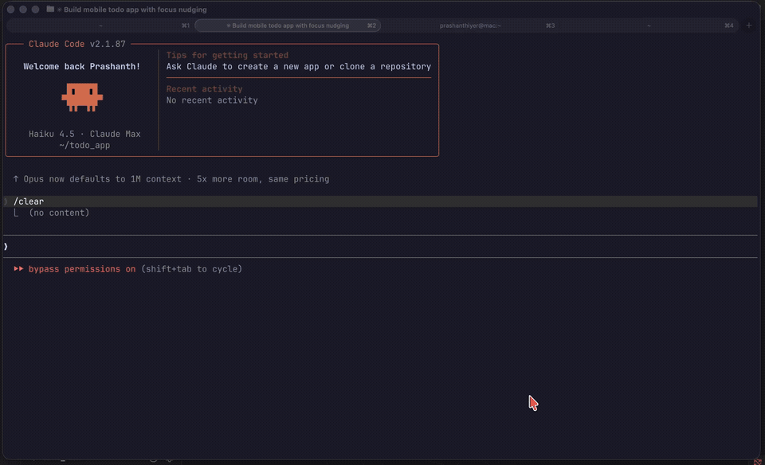
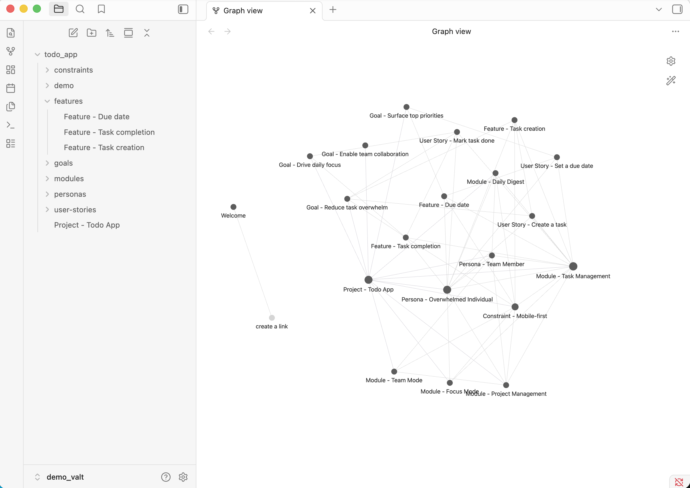

# 🛰️ recon

### Obsidian × AI Knowledge Base

> Your project's brain — built by AI, lived in Obsidian.

[](https://pypi.org/project/deploysquad-recon-core/)
[](LICENSE)
[](https://claude.ai/code)
[](https://obsidian.md)



[▶ Watch full demo](assets/demo.mp4)

```
/plugin marketplace add deploysquad-ai/recon
/plugin install recon@deploysquad-ai/recon
```

*then run `/recon.setup`, restart Claude Code, and run `/recon`*

---

## What it does

recon is a Claude Code MCP server that turns a natural conversation into a structured project knowledge graph — stored as Markdown in your Obsidian vault.

You describe your project. Claude infers goals, personas, modules, decisions, and features — then writes them as linked nodes. No forms. No templates to fill out.

The graph then feeds focused context back to any AI session via `generate_context()` — so Claude always knows what you're building, every session.



---

## The loop

```
💬 /recon          →   🧠 graph          →   ⚡ CONTEXT.md     →   🏗️ build
describe project       10 node types         per feature            with full context
                                                                          ↓
                    ←──────────────── 🔄 /recon.add-feature ────────────┘
                                      keep graph current
```

---

## Works with your AI dev workflow

recon connects directly to AI-assisted development workflows:

**Generate context for any feature — written straight to your vault:**
```
"generate context for Task Board"
→ writes features/CONTEXT - Task Board.md
```

Claude reads the context file and starts every session informed — goals, constraints, decisions, personas. No re-explaining.

**Track specs back to the graph:**
```
"link the spec to Task Board"
→ Feature node now points to the spec file
```

Query "which features have specs?" or "what's the spec for Task Board?" — the graph stays connected end to end.

**The full cycle:**
```
/recon                    → build the graph
"generate context for X"  → write CONTEXT.md to vault
/brainstorming            → read context, produce spec
"link the spec to X"      → connect spec back to feature
```

→ [Full integration guide](docs/integration.md)

---

## Quick start

1. Add the marketplace: `/plugin marketplace add deploysquad-ai/recon`
2. Install the plugin: `/plugin install recon@deploysquad-ai/recon`
3. Configure your vault: run `/recon.setup` and enter your Obsidian vault path
4. Restart Claude Code
5. Run `/recon` — describe your project and watch the graph appear in Obsidian

---

## Node types

recon builds a graph using 10 structured node types:

| Type | Purpose |
|------|---------|
| **Project** | Root node — name, description, status |
| **Goal** | Why you're building it |
| **Persona** | Who uses it |
| **Constraint** | Hard limits (tech, legal, budget) |
| **Module** | Architectural components |
| **Decision** | Key choices made and why |
| **User Story** | User-facing requirements |
| **Epic** | Feature groupings |
| **Feature** | Implementable units — context bundles start here. Supports `spec_path` to link back to technical specs |
| **Version** | Release milestones |

All nodes are Markdown files with YAML frontmatter, linked via Obsidian wikilinks. Open your vault in Obsidian to see the graph view.

---

## How it works

```
Claude Code  →  /recon skill  →  recon MCP server  →  recon-core (Python)  →  Obsidian vault
(you type)      (prompts you)    (validates, routes)   (writes .md files)     (graph view)
```

- **MCP server** (`deploysquad_recon_core.mcp_server`): exposes 10 tools callable by Claude
- **recon-core** (Python): Pydantic v2 models, vault I/O, graph index, context generation
- **Skills**: `/recon` for initial authoring, `/recon.add-feature` for incremental updates

---

## Requirements

- [Claude Code](https://claude.ai/code) (the CLI)
- [Obsidian](https://obsidian.md) (to view the graph — optional but recommended)
- [uv](https://docs.astral.sh/uv/) — Python package runner used by the MCP server (`curl -LsSf https://astral.sh/uv/install.sh | sh`)

---

## License

MIT © [DeploySquad](https://github.com/deploysquad-ai)
